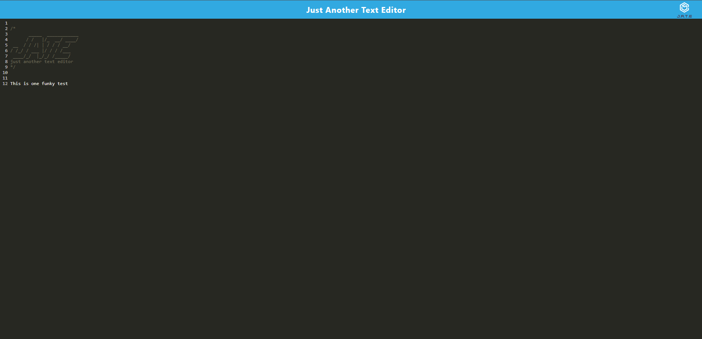

# User Thought App

## Description

This program allows you to use and modify a text editor. You can also install the editor by hitting the 'install' button.

## Installation

If you download the application, you can run it using nodejs, running npm run install then npm run start. You can also go to [here](https://jate-jaymen.herokuapp.com/)

## Usage

[Webpage](https://jate-jaymen.herokuapp.com/)

## Credits

Jaymen Laton
[Github Repo](https://github.com/CanadianMRE/JATE-Text-Editor)

## License

None

## Questions

Visit my github at [CanadianMRE](https://github.com/CanadianMRE)
or
Contact me through email at jaymen100@gmail.com
